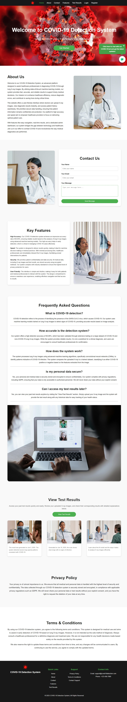

# COVID-19-Detection-WebApp
A Flask-based web application using CNNs to detect COVID-19 from lung X-ray images, developed as a Final Year Project at GIMS, PMAS-Arid Agriculture University.

# COVID-19 Detection Using Lungs X-ray Images



## Project Overview
This project, titled **"COVID-19 Detection Using Lungs X-ray Images"** (Project ID: GIMS-BSSE-F20212), is a Final Year Project submitted in partial fulfillment of the requirements for the degree of **Bachelor of Science in Software Engineering (BSSE Hons.)** at Gujrat Institute of Management Sciences (GIMS), PMAS-Arid Agriculture University, Rawalpindi. The system leverages deep learning, specifically Convolutional Neural Networks (CNNs), to detect COVID-19 from lung X-ray images, providing an efficient, accurate, and accessible diagnostic tool. A Flask-based web application enables users to upload X-ray images and receive real-time diagnostic results, aimed at assisting healthcare providers in early detection, particularly in resource-constrained regions.

## Project Team
- **Muzamal Asghar (Group Leader)**  
  Registration #: 21-Arid-3433  
  Email: [muzamalasghar47@gmail.com](mailto:muzamalasghar47@gmail.com)  
  Class: BSSE
- **Fahad Waseem**  
  Registration #: 21-Arid-3413  
  Email: [fwaseem693@gmail.com](mailto:fwaseem693@gmail.com)  
  Class: BSSE
- **Supervisor**: Ms. Aliza Falak, Lecturer, GIMS  
- **Date Started**: November 13, 2024  
- **Date Completed**: June 3, 2025  

## Objectives
The primary goal is to develop an AI-powered system for detecting COVID-19 from lung X-ray images with the following objectives:
1. Build a fast, efficient, and accurate CNN-based detection system.
2. Develop a user-friendly web application accessible via an internet connection.
3. Enable early COVID-19 detection to support healthcare decision-making.
4. Provide an affordable diagnostic solution for remote and under-resourced areas.
5. Ensure reliability through rigorous testing on diverse datasets.
6. Inspire future innovations in medical diagnostics for diseases like pneumonia and tuberculosis.

## Features
### User Features
- Secure login and password reset functionality.
- Upload lung X-ray images for analysis.
- Real-time COVID-19 detection with probability scores.
- View detection history.

### Admin Features
- Manage user accounts and datasets.
- Train and update the CNN model.

### System Features
- Automated image preprocessing (resizing, normalization).
- CNN model training and evaluation.
- Dynamic Flask debug mode (disabled during training).

## Technologies Used
### Machine Learning & Deep Learning
- **TensorFlow & Keras**: CNN model development and training.
- **Scikit-learn**: Data preprocessing and evaluation metrics.
- **OpenCV**: Image preprocessing (resizing, normalization).

### Web Development
- **Flask**: Backend framework for the web application.
- **HTML, CSS, JavaScript**: Frontend interface.
- **SQLite**: Database for user data and dataset metadata.

### Development Tools
- **Anaconda**: Environment management.
- **Jupyter Notebook**: Model prototyping and testing.
- **Google Colab**: Optional cloud-based training.
- **Matplotlib & Seaborn**: Data and performance visualization.

### System Requirements
- **OS**: Windows 11 Pro (compatible with macOS/Linux).
- **Hardware**:
  - **Minimum**: Dual-core CPU, 8 GB RAM, 100 GB storage.
  - **Recommended**: Quad-core CPU, NVIDIA GPU (e.g., GTX 1060), 16 GB RAM, 256 GB SSD.

## Installation & Setup
### 1. Check Python Environment
Verify your Python version and environment:
```bash
python --version       # Ensure Python 3.8+
where python           # Windows: Verify Python path
# OR
which python           # Linux/macOS: Verify Python path
conda info --envs      # List Conda environments (* marks active)
```

### 2. Activate Environment
Activate or create the project environment:
```bash
conda activate Covid-19_Git
# If not created:
conda create -n Covid-19_Git python=3.8
conda activate Covid-19_Git
```

### 3. Install Dependencies
Install required libraries:
```bash
pip install flask tensorflow keras pillow opencv-python scikit-learn matplotlib numpy pandas
```
Or use the `requirements.txt` file:
```bash
pip install -r requirements.txt
```

### 4. Clone the Repository
Clone the project from your Git repository:
```bash
git clone <repository_url>  # Replace with your repo URL
cd webapp
```

### 5. Project Structure
Ensure your directory matches the following structure:
```
webapp/
├── __pycache__/
├── datasets/               # Dataset storage
├── model/                  # Saved CNN models (e.g., trained_model.h5)
├── static/
│   ├── css/                # CSS styles
│   ├── images/             # Static images
│   ├── js/                 # JavaScript files
│   ├── profile_images/     # User profile images
│   └── uploads/            # Uploaded X-ray images
├── templates/              # HTML templates
│   ├── admin_dashboard.html  # Admin dashboard UI
│   └── login.html          # Login page UI
├── WindowsPowerShell/      # PowerShell scripts (if any)
├── app.py                  # Main Flask app
├── covid_detection.db      # SQLite database
├── init_db.py              # Database initialization script
├── requirements.txt        # Dependencies list
├── webapp.py               # Flask app script

```

### 6. Dataset Configuration
- Place your dataset ZIP file (containing `COVID` and `NORMAL` subfolders) in the `datasets/` folder.
- Update `init_db.py` or `webapp.py` to point to the dataset:
```python
c.execute("INSERT OR IGNORE INTO datasets (dataset_url) VALUES (?)", ("datasets/dataset.zip",))
```

## Running the Application
### 1. Start the Flask App
Run the application:
```bash
python app.py
# OR
python webapp.py
```
- Server runs at `http://127.0.0.1:5000` with `debug=True`.

### 2. Access the System
- **Login**:
  - URL: [http://127.0.0.1:5000/login](http://127.0.0.1:5000/login)
  - Credentials:
    - Email: `admin@gmail.com`
    - Password: `admin#123`
  - Redirects to the admin dashboard.

### 3. Train the Model
- Navigate to "Start Model Training" on the dashboard.
- Input:
  - Algorithm: `CNN`
  - Epochs: `20`
  - Batch Size: `512`
  - Dataset ID: `1`
- Click "Start Training".
- **Behavior**: Debug mode switches to `False`, training runs, then reverts to `True`.

### 4. Upload & Detect
- Upload an X-ray image via the dashboard (future UI feature).
- Receive COVID-19 detection results with probability scores.

### 5. Monitor Progress
- Check training status via `/admin/training_progress`:
```bash
curl http://127.0.0.1:5000/admin/training_progress
```

## Dataset
- **Source**: Kaggle COVID-19 X-ray Dataset, NIH Chest X-ray Dataset.
- **Size**: 5,000 images (4,000 training, 1,000 validation).
- **Classes**:
  - `COVID`: Positive cases.
  - `NORMAL`: Healthy lungs.
- **Format**: RGB, resized to 224x224 pixels.

## Model Performance
- **Training**:
  - Epochs: 20
  - Batch Size: 512
  - Optimizer: Adam
- **Evaluation**:
  - Test Loss: 0.0089
  - Test Accuracy: 99.54%
  - Precision (COVID): 98.77%
  - Recall (COVID): 40.25%
  - F1-Score (COVID): 57.27%

## Git Workflow
### 1. Check Status
```bash
git status
```

### 2. Stage Changes
```bash
git add .
```

### 3. Commit
```bash
git commit -m "Completed CNN training and web app integration"
```

### 4. Push
```bash
git push origin main
```

### Save Dependencies
```bash
pip freeze > requirements.txt
```

## Deliverables
- **Executable File**: `.exe` for Windows.
- **Documentation**: PDF/DOCX report.
- **CD/DVD**: Contains code, model, dataset, and manual.
- **User Manual**: PDF with setup and usage instructions.
- **Pre-trained Model**: `trained_model.h5`.
- **Dataset**: Processed images and labels.

## Limitations
- Dependent on dataset quality and diversity.
- Limited to COVID-19 detection only.
- Requires high-quality X-ray images.
- Internet connection needed for web access.

## Future Enhancements
- Add multi-disease detection (e.g., pneumonia, tuberculosis).
- Implement a user-facing upload interface.
- Enhance security with password hashing.
- Deploy on a production server (e.g., Gunicorn).

## Acknowledgments
We express our gratitude to **Allah Almighty** for guidance, our supervisor **Ms. Aliza Falak** for her mentorship, and our families and friends for their unwavering support.

## Contributors
- **Muzamal Asghar**: Lead Developer  
- **Fahad Waseem**: Co-Developer  
- **Institution**: Gujrat Institute of Management Sciences, PMAS-Arid Agriculture University, Rawalpindi

## License
This project is licensed under the [MIT License](LICENSE) (add a `LICENSE` file if needed).
